---
## Front matter
title: "Отчёт по лабораторной работе 6"
subtitle: "Архитектура компьютеров и операционные системы"
author: "Алина Молокова"

## Generic otions
lang: ru-RU
toc-title: "Содержание"

## Bibliography
bibliography: bib/cite.bib
csl: pandoc/csl/gost-r-7-0-5-2008-numeric.csl

## Pdf output format
toc: true # Table of contents
toc-depth: 2
lof: true # List of figures
lot: true # List of tables
fontsize: 12pt
linestretch: 1.5
papersize: a4
documentclass: scrreprt
## I18n polyglossia
polyglossia-lang:
  name: russian
  options:
	- spelling=modern
	- babelshorthands=true
polyglossia-otherlangs:
  name: english
## I18n babel
babel-lang: russian
babel-otherlangs: english
## Fonts
mainfont: PT Serif
romanfont: PT Serif
sansfont: PT Sans
monofont: PT Mono
mainfontoptions: Ligatures=TeX
romanfontoptions: Ligatures=TeX
sansfontoptions: Ligatures=TeX,Scale=MatchLowercase
monofontoptions: Scale=MatchLowercase,Scale=0.9
## Biblatex
biblatex: true
biblio-style: "gost-numeric"
biblatexoptions:
  - parentracker=true
  - backend=biber
  - hyperref=auto
  - language=auto
  - autolang=other*
  - citestyle=gost-numeric
## Pandoc-crossref LaTeX customization
figureTitle: "Рис."
tableTitle: "Таблица"
listingTitle: "Листинг"
lofTitle: "Список иллюстраций"
lotTitle: "Список таблиц"
lolTitle: "Листинги"
## Misc options
indent: true
header-includes:
  - \usepackage{indentfirst}
  - \usepackage{float} # keep figures where there are in the text
  - \floatplacement{figure}{H} # keep figures where there are in the text
---

# Цель работы

Целью работы является освоение арифметических инструкций языка ассемблера NASM.

# Выполнение лабораторной работы

## Символьные и численные данные в NASM

Я создала папку для хранения файлов, связанных с шестой лабораторной работой, 
и перешла в эту папку. Затем я создала файл с кодом программы, который 
назвала lab6-1.asm. (рис. [-@fig:001])

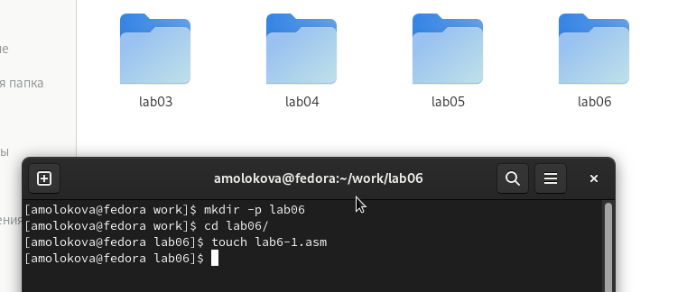{ #fig:001 width=70%, height=70% }

На следующем рисунке (рис. [-@fig:002]) показана программа, где я помещаю символ '6' 
в регистр eax с помощью команды mov eax, '6', а символ '4' - в регистр ebx с помощью 
команды mov ebx, '4'. После этого я складываю значения из регистров eax и ebx, 
используя команду add eax, ebx, и результат сложения сохраняется в регистре eax. 
Чтобы вывести результат на экран, мне нужно использовать функцию sprintLF, которая 
требует адреса в регистре eax. Поэтому я сохраняю результат из eax в переменную buf1 
с помощью команды mov [buf1], eax, а затем загружаю адрес переменной buf1 обратно 
в регистр eax командой mov eax, buf1 перед вызовом функции sprintLF.

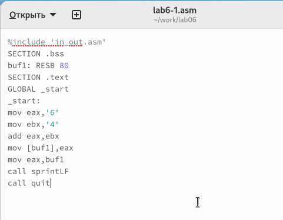{ #fig:002 width=70%, height=70% }

Однако, когда я ожидаю увидеть число 10 на экране после вывода содержимого регистра eax, 
на деле я вижу символ 'j'. Это происходит потому, что символ '6' имеет двоичный код 
00110110 (или 54 в десятичной системе), а символ '4' - двоичный код 00110100 (или 52 
в десятичной системе). Поэтому, когда я выполняю сложение с помощью команды add eax, 
ebx, в результате получается 01101010 (или 106 в десятичной системе), что соответствует 
символу 'j'. (рис. [-@fig:003])

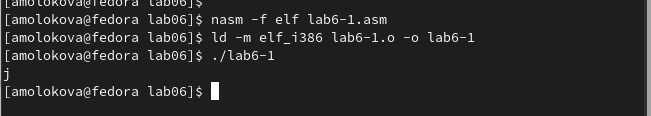{ #fig:003 width=70%, height=70% }

Далее изменяю текст программы и вместо символов, запишем в регистры числа. (рис. [-@fig:004])

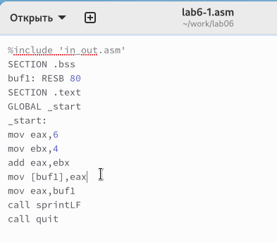{ #fig:004 width=70%, height=70% }

Как и в прошлый раз, когда я запустила программу, ожидаемое число 10 не появилось 
на экране. Вместо этого был выведен символ с кодом 10, который является символом 
конца строки или возвратом каретки (рис. [-@fig:005]). 
Этот символ не виден в консоли, но он создает пустую строку между строками текста.

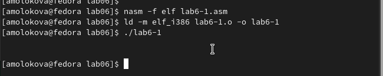{ #fig:005 width=70%, height=70% }

Как я уже упоминала ранее, в файле in_out.asm были написаны специальные подпрограммы, 
чтобы можно было работать с числами, преобразовывая ASCII символы в числа и наоборот. 
Я внесла изменения в текст программы, чтобы использовать эти функции. (рис. [-@fig:006])

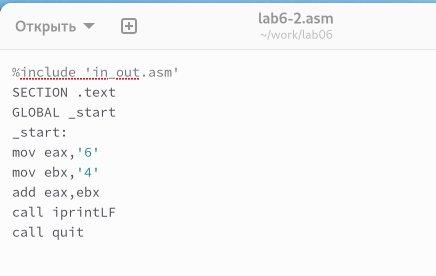{ #fig:006 width=70%, height=70% }

После запуска измененной программы на экране появилось число 106 (рис. [-@fig:007]). 
В этом случае, как и в первом примере, команда add складывает коды символов '6' и '4' 
(54+52=106), но в отличие от предыдущей версии программы, функция iprintLF позволяет 
вывести на экран именно число, а не символ с соответствующим кодом.

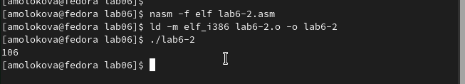{ #fig:007 width=70%, height=70% }

Также я изменила символы на числа, как это было в предыдущем примере. (рис. [-@fig:008])

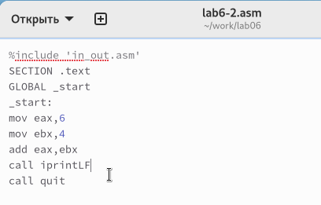{ #fig:008 width=70%, height=70% }

Благодаря функции iprintLF, которая выводит число, и тому, что в качестве 
операндов использовались числа, а не коды символов, на экране появилось число 10.
(рис. [-@fig:009])

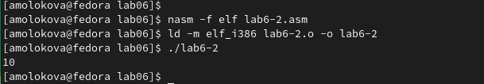{ #fig:009 width=70%, height=70% }

Затем я заменила функцию iprintLF на iprint, собрала исполняемый файл и запустила его. 
В этот раз результат отличался отсутствием переноса строки после 
выводимого числа.(рис. [-@fig:010])

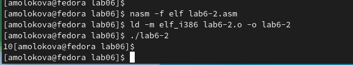{ #fig:010 width=70%, height=70% }

## Выполнение арифметических операций в NASM

В качестве примера выполнения арифметических операций в NASM приведем 
программу вычисления арифметического выражения (рис. [-@fig:011]) (рис. [-@fig:012])
$$f(x) = (5 * 2 + 3)/3$$.

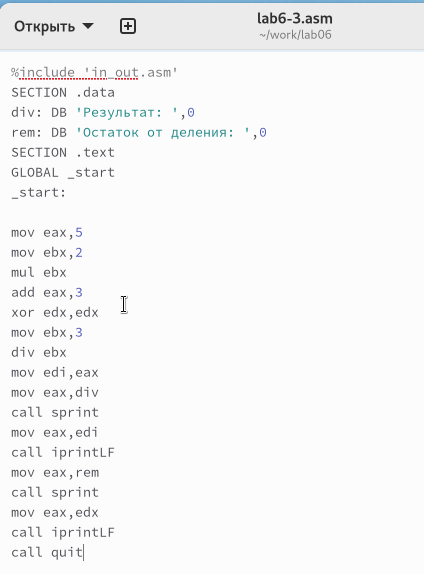{ #fig:011 width=70%, height=70% }

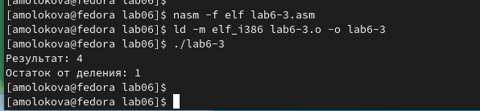{ #fig:012 width=70%, height=70% }

Изменила текст программы для вычисления выражения 
$$f(x) = (4 * 6 + 2)/5$$. 
Создала исполняемый файл и проверил его работу. (рис. [-@fig:013]) (рис. [-@fig:014])

{ #fig:013 width=70%, height=70% }

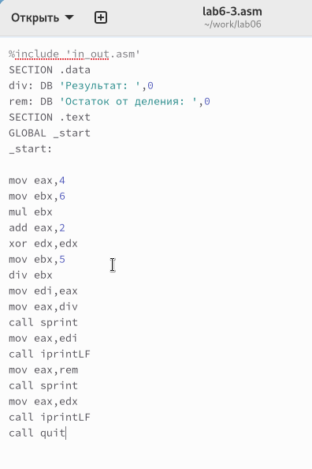{ #fig:014 width=70%, height=70% }

В качестве другого примера рассмотрим программу вычисления варианта задания по 
номеру студенческого билета. (рис. [-@fig:015]) (рис. [-@fig:016])

В данном случае число, над которым необходимо проводить арифметические операции,
вводится с клавиатуры. Как отмечалось выше ввод с клавиатуры осуществляется 
в символьном виде и для корректной работы арифметических операций в NASM символы 
необходимо преобразовать в числа. Для этого может быть использована функция 
atoi из файла in_out.asm.

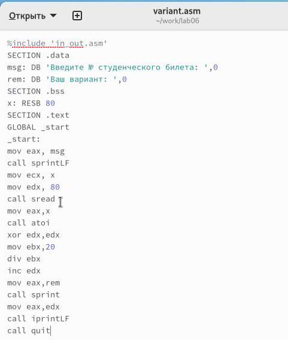{ #fig:015 width=70%, height=70% }

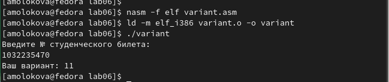{ #fig:016 width=70%, height=70% }

## Ответы на вопросы

1. Какие строки листинга отвечают за вывод на экран сообщения ‘Ваш вариант:’?

Команда "mov eax, rem" загружает в регистр значение, соответствующее строке "Ваш вариант:".

Команда "call sprint" инициирует процедуру, которая выводит строку на экран.

2. Для чего используются следующие инструкции?

Инструкция "mov ecx, x" копирует значение из переменной x в регистр ecx.

Инструкция "mov edx, 80" помещает число 80 в регистр edx.

Инструкция "call sread" активирует функцию чтения данных студенческого билета через консоль.

3. Для чего используется инструкция "call atoi"?

Команда "call atoi" преобразует строковые символы в целочисленное значение.

4. Какие строки листинга отвечают за вычисления варианта?

Команда "xor edx, edx" очищает содержимое регистра edx.

Команда "mov ebx, 20" помещает число 20 в регистр ebx.

Команда "div ebx" делит число студенческого билета на 20.

Команда "inc edx" увеличивает содержимое регистра edx на единицу.

5. В какой регистр записывается остаток от деления при выполнении инструкции "div ebx"?

Результат остатка от деления помещается в регистр edx.

6. Для чего используется инструкция "inc edx"?

Команда "inc edx" прибавляет единицу к содержимому регистра edx, что необходимо для расчета номера варианта.

7. Какие строки листинга отвечают за вывод на экран результата вычислений?

Команда "mov eax, edx" переносит результат расчетов в регистр eax.

Команда "call iprintLF" запускает подпрограмму, которая выводит результат на экран.

## Задание для самостоятельной работы

Написать программу вычисления выражения y = f(x). Программа должна выводить выражение 
для вычисления, выводить запрос на ввод значения x, 
вычислять заданное выражение в зависимости от введенного x, выводить результат вычислений. 
Вид функции f(x) выбрать из таблицы 6.3 вариантов заданий в соответствии с номером 
полученным при выполнении лабораторной работы. 
Создайте исполняемый файл и проверьте его работу для значений x1 и x2 из 6.3.

Получили вариант 11 - $$ 10 * (x + 1) - 10$$  для $$x=1, x=7$$ (рис. [-@fig:017]) (рис. [-@fig:018])

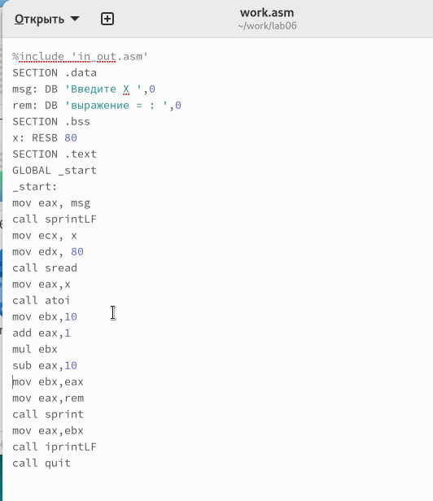{ #fig:017 width=70%, height=70% }

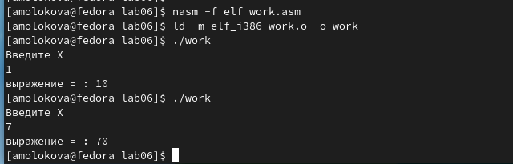{ #fig:018 width=70%, height=70% }

# Выводы

Изучили работу с арифметическими операциями.